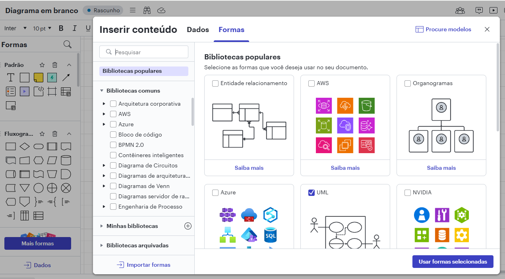
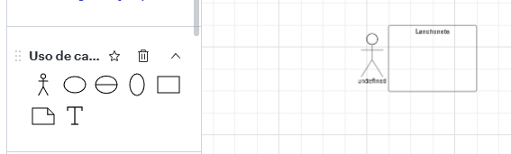
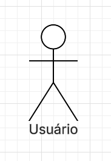

# Criaçaõ de diagrama UML

Situação de Aprendizagem 2: Desenvolvimento de Estruturas de Dados e Lógica CRUD
Objetivo: Criação de modelos de dados (classes/objetos) para o Back-End. Implementação da lógica de tratamento de requisições (POST/GET) e manipulação de dados (CRUD - Criar, Ler, Atualizar, Deletar), utilizando Node.js/Express.

Gerenciador de Pedidos de Lanche (In-Memory)

Descrição: Desenvolver uma API Node.js/Express que gerencie uma lista de pedidos de lanche (Armazenamento em memória, sem banco de dados ainda). A API deve ter rotas para: (C) Criar um novo pedido (POST), (R) Listar todos os pedidos e buscar um pedido por ID (GET), (U) Atualizar o status de um pedido (PATCH ou PUT), e (D) Cancelar um pedido (DELETE). Isso exige a criação de classes ou objetos para modelar o pedido e o tratamento correto das requisições HTTP

 

Site: https://www.lucidchart.com/pages/pt/

Para desanha caso de Uso.

01. Criar um documento em branco.

02. Clique e mais formas, e selecion UML

03. Selcione o Quadrado e coloca nome "Lanchonete", precisa pegar o caso de USO.

04. Foi definio o Usuário que seleciona e conversar com a classe, para fazer um pedido

# Para configurar.

Rodar os comandos para poder iniciar um projeto, rodar os camando a baixo.

01. Abrir o VsCode

02. Control + ' = para poder mudar para CMD ou mudar para CMD

03. npm init -y

04. npm npm install express

05. Criar o arquivo index.js 

Criar um comando mínimo para iniciar

const express = require("express")
const app = express()

app.length("/", function(req, res){
    res.send("funciona")
})

app.listem(3000)

06. 